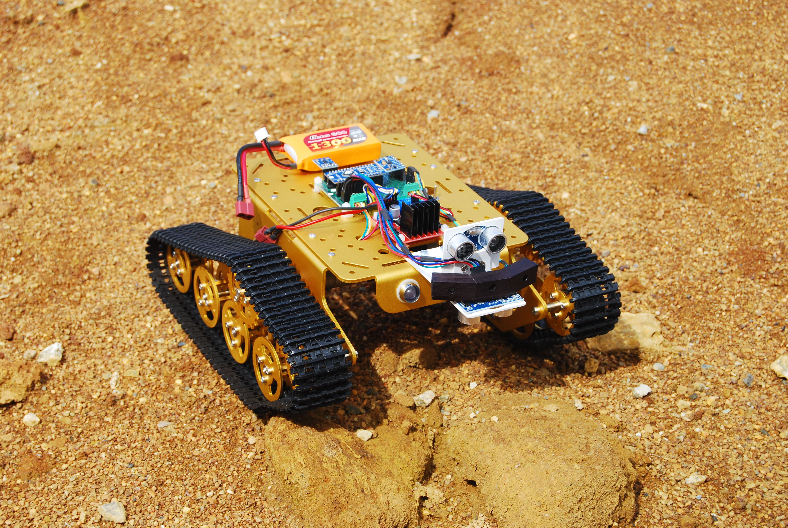

# Microbit-Mission-to-Mars-Remote
One hour exercise to introduce Software Cornwall and the Mission to Mars Rover to students around the county. It will
also be used at PyconUK 2019 in Cardiff. So if you are interested in trying it out come along.

# Create a Remote Control for The Mars Rover
This exercise has been designed to enable you to work out what there is to be done. We are not giving you the answers, 
only some guidance. We would like you to take the lead and persevere in getting this to work.



The Mission to Mars Rover has been provided with a drive system controlled by a MicroBit. This Microbit will receive 
instructions from another using radio. Your task is to program this second Microbit and take control of the rover.

## The Coding Environment

You will be using the Mu Python editor. You will be coding in Python and flashing the code onto your Microbit provided.

The radio is easy to use. It just requires it to be turned on and then for a message to be sent, something like this. 
**Read this, do not type anything yet!**

```
from microbit import *
import radio

# Lines of code with a hash # are comments just for human readability
# They do not have to be used here but it is a good habit to write them
	
radio.on()
radio.send(“Forwards”)
```
This code would run when the Microbit is switched on broadcasting the single message “Forwards”. 
Sending different messages can be used to control equipment attached to another Microbit. Which is what we have here.

## Setting up the Remote Control

On the remote control MicroBit there are two buttons. To use them for left and right could be good. But how to 
command forwards and backwards. What the MicroBit does have is an accelerometer measuring how the MicroBit is tilted, 
left, right, up and down. This would make a good control mechanism. 

Here, in blue, is the code to get you started.

Don’t miss out the colons and lines indented in from the edge. 
Watch for spelling and Capital Letters.
```
from microbit import *
import radio

# This is the start of a loop of code
while True:
	# check if MicroBit is held downwards
    	if accelerometer.is_gesture(“down”):
# send a capital F as this message matches the rover’s code 		
        	radio.send(“F”)
# put an arrow north on the Led display	
        	display.show(Image.ARROW_N)
```
Flash your code onto the Microbit and try it out. Then add more code instead of the red text. 
From the code above we have introduced an if .. else check. You’ll need more code with elif to check for 
the other positions which are down, left and right. The other arrows are S (south), W (west) and of course E (east).
```
    	# elif means else if. You will need a few of these with code.
elif 	# use 3 elif instead of “if” using same code reasoning as above.	
        	# add elif code lines to check up, left & right
 		# to use for backwards, left & right

	# These next lines are a final catch-all. Use it just as they are.
    	else:
		# send an S for Stop if no direction is detected
        		radio.send(“S”)	
# display nothing or maybe something else? See below.
        		display.clear()	
	
    	sleep(10)	# a very short delay to keep the signal steady. Indented once.
```
Available images to use instead of clear are:
HEART, SAD, CONFUSED, ANGRY, ASLEEP, SURPRISED, SILLY, FABULOUS, MEH, CHESSBOARD, RABBIT, COW, PITCHFORK, 
XMAS, PACMAN, TARGET, TSHIRT, ROLLERSKATE, DUCK, HOUSE, TORTOISE, BUTTERFLY, STICKFIGURE, GHOST, SWORD, 
GIRAFFE, SKULL, UMBRELLA, SNAKE.

